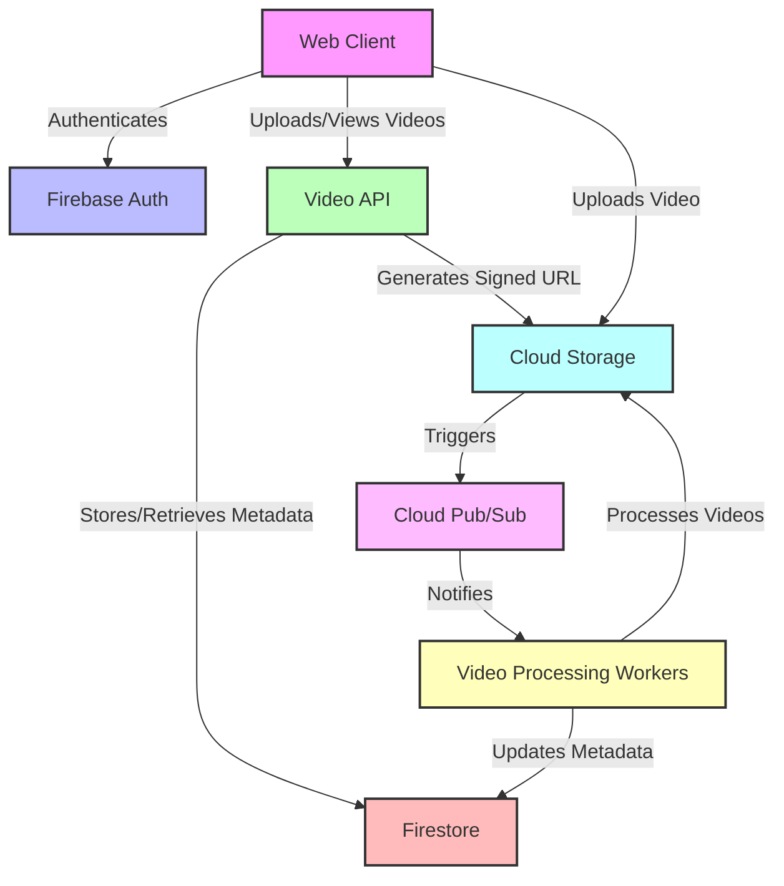

# MTube Architecture

This project implements a simplified video platform clone with core functionality. The architecture is designed for simplicity and scalability, utilizing various Google Cloud services.

## Key Components:

1. **Video Storage**: Google Cloud Storage
   - Hosts raw and processed videos

2. **Video Upload Events**: Cloud Pub/Sub
   - Manages video upload events for asynchronous processing

3. **Video Processing**: Cloud Run
   - Workers that transcode videos using ffmpeg

4. **Video Metadata**: Firestore
   - Stores processed video metadata

5. **Video API**: Firebase Functions
   - Handles video uploads and metadata retrieval

6. **Web Client**: Next.js / Cloud Run
   - User interface for video upload and viewing

7. **Authentication**: Firebase Auth
   - Manages user authentication with Google Sign-In

## Key Features:

- Google account sign-in/out
- Video upload for authenticated users
- Video transcoding to multiple formats
- Listing and viewing uploaded videos (authenticated and unauthenticated)

This architecture provides a scalable foundation for a video sharing platform, with room for future enhancements and optimizations.
